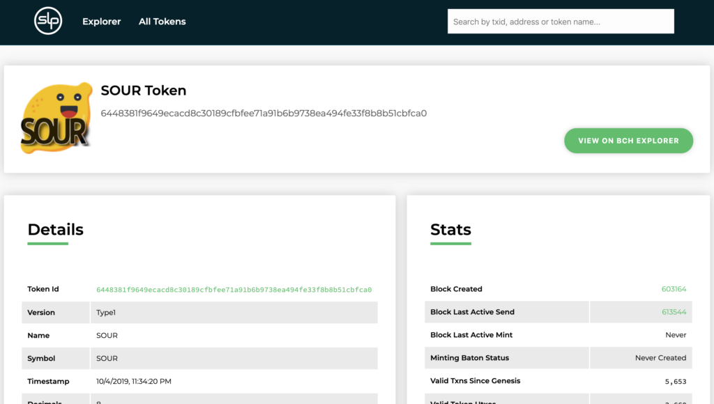

# Add an icon for your SLP Token

*https://simpleledger.info/#token/6448381f9649ecacd8c30189cfbfee71a91b6b9738ea494fe33f8b8b51cbfca0*

When your token is created (either on Memo or Electron Cash SLP), it will be assigned a default icon. In order to change that icon, you will need a GitHub account & the icon files in different sizes. There are a few different GitHub repositories that house token icons for different apps and serve those icons from censorship resistant servers.

- You will first need to create a GitHub account if you don’t already have one.
- Next [fork the below repo](https://guides.github.com/activities/forking/) from your account (On repo page, click the fork button):  
[https://github.com/kosinusbch/slp-token-icons](https://github.com/kosinusbch/slp-token-icons)

`git clone https://github.com/yourUSERNAME/slp-token-icons`

- Make your changes on your fork by adding the images to the corresponding paths within your repo. Don’t change any other files, only add your own. At this point, you can either open the repo in a file explorer and then drag & drop your files into it or you can copy them via command-line.
- The format is /{size}/{txid}.{format}  
{size} can be any number from 1-2399 (or “original”)  
{txid} is the transaction id of the token genesis transaction  
{format} can be png, jpg, tiff or webp  

*https://github.com/kosinusbch/slp-token-icons*

`cd slp-token-icons`

`cp TOKENID.jpg path/{size}/{txid}(tokenID).jpg/png/tiff/webp`

Repeat cp for each size of token icon.

- Next commit your changes. The below commands will add all changes, stage them for commit with a message & then push them back into your forked repo.
```
git add *
git commit -m 'commit message'
git push
```

At this point, you have your token icons in your own forked repository, under the correct sizes, with the tokenID as your icon name. Now you will need to open a Pull Request from the original repo in order to add your changes in there. 

Go back to the [original repo](https://github.com/kosinusbch/slp-token-icons) and click “New pull request”. From the Compare Changes page, select your repository & changes to merge into the original one.
The pull request will need to be reviewed & approved so it can take a few days or couple weeks, depending on the dev(s) maintaining the repo.

For the Badger wallet & Bitcoin.com explorer (and possibly Bitcoin.com wallet), you will need to go through the same process for the following repository: 
[https://github.com/Bitcoin-com/bch-token-icons](https://github.com/Bitcoin-com/bch-token-icons)


You can get more help on the SLP Devs telegram group: [https://t.me/slp_devs_for_hire](https://t.me/slp_devs_for_hire)

The SOUR token displays the icon for the SLP explorer because a pull request was created and accepted for kosinusbch/slp-token-icons. 


*https://simpleledger.info/#token/6448381f9649ecacd8c30189cfbfee71a91b6b9738ea494fe33f8b8b51cbfca0*

