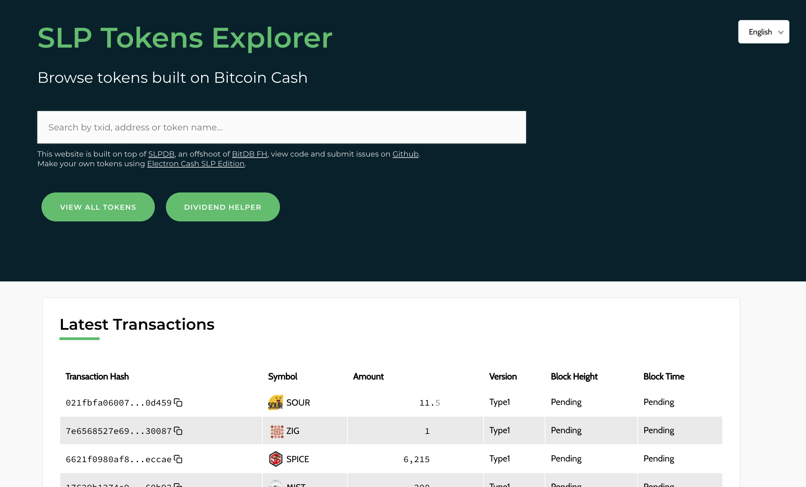
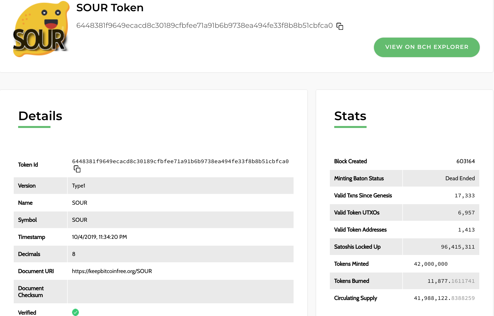
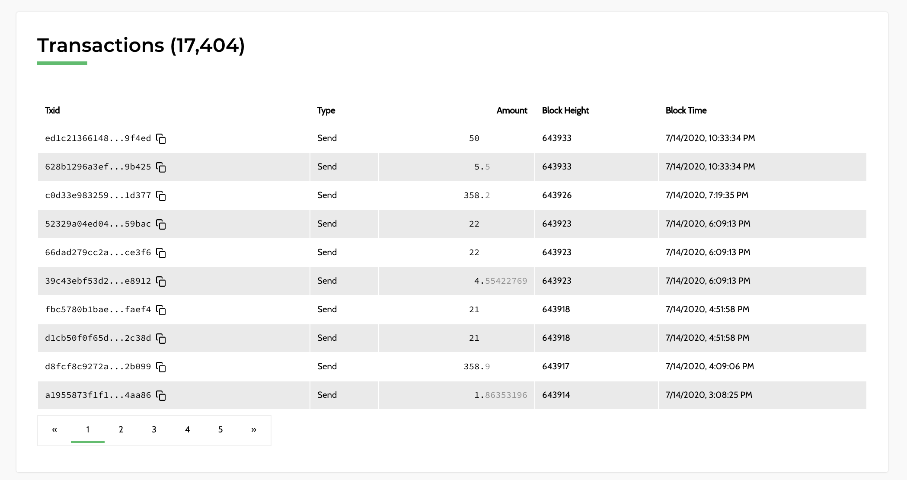
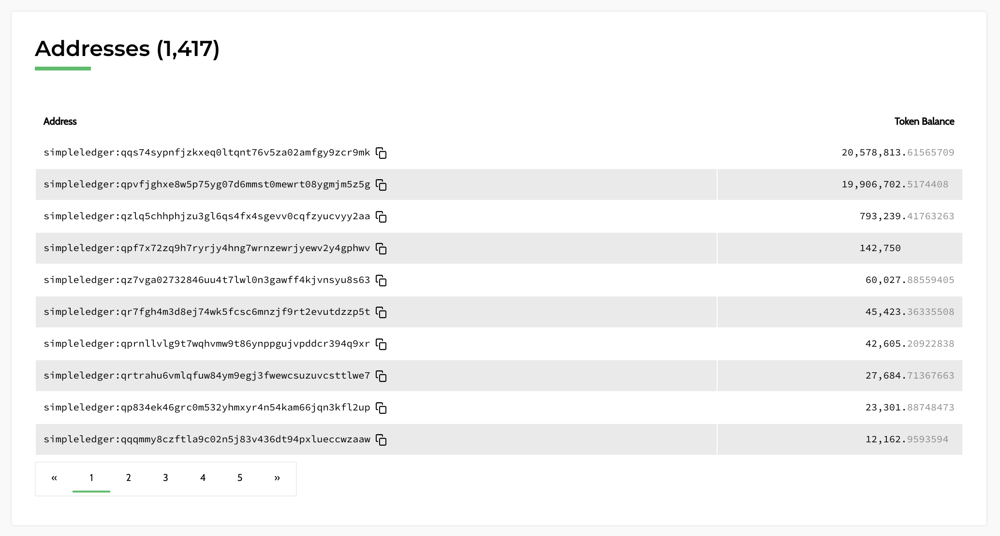

# How to use the SLP Explorer

<!-- *The Homepage of the Simple Ledger Protocol Explorer used to search addresses, txid and tokens.* -->

[The SLP explorer](https://simpleledger.info) is a debugging tool for the Simple Ledger Protocol on the Bitcoin Cash blockchain. It can be used to search for transaction ids (txid), addresses, or token names, check token balances of an SLP address, and view details of a transaction. It also provides other general information about SLP token transactions such as the latest transactions, usage charts, new tokens created and latest token burns. The explorer gives users and developers a quick and easy way to check address or transaction data when not able to access a wallet.

The SLP explorer is open source and the source code is available on [Github](https://github.com/blockparty-sh/slp-explorer). It is open for the submission of issues, collaboration, code review or forking to create your own.

## Searching by Address, txid (Transaction ID) or Token Name

When you open up [the SLP explorer](https://simpleledger.info), there is a search box, SLP transaction usage info, charts and other links. The search box here can be used to quickly search for an address, txid or token name. You can also view info about all SLP tokens ever created. Pasting by an address or transaction id in the search bar will take you directly to the info page for that address or txid. Searching by a token name will pull up all related options for that token filtered by which are tokens are verified. Always verify the token id yourself, as that is the unique identifier for a token. Token names and icons can be duplicated but token id is always unique.

*Searching by token name will allow you to filter by verified tokens with that name.*

## Address Details

**SLP Address** - Public receive address of SLP tokens.  
**Cash Address** - Public receive address of Bitcoin Cash in Cash Address format.  
**Legacy Address** - Public reveive address of Bitcoin Cash in Legacy format.   
**Cash Account** - Publicly linked Cash Account used in sending BCH to a Cash Account alias instead of BCH address.  
**Sent SLP Transactions** - Total number of sent SLP token transactions.  
**Received SLP transactions** - Total number of received SLP token transactions.  
**Token balances** - Balances of each SLP token within the address.  

**Transactions** - List of all transactions associated with the address.  
**Transactions Charts** - Customizable usage charts of the address' transactions.  
**Burn History** - All burn transactions associated with the address.  

Each address has an associated simpleledger, cashaddr & legacy address format. Currently with most wallets, Bitcoin Cash is still required in order to send SLP tokens (as gas to fund the tx). The page also shows all the transactions for that address, which can be used to track funds across different transactions and addresses. 

## Types of Transactions

1. **Genesis**
	- Genesis transaction is the creation of a new token
	- A token's ID is it's genesis transaction and the unique identifier for the token. There can be tokens with the same name or icon but each token will have it's own unique genesis txid, or token ID.
2. **Mint**
	- Minting of new tokens through a minting baton
3. **Send** 
	- A standard SLP token "send" transaction on the blockchain. SLP Tokens and coins are stored in unspent transaction outputs or a utxo. If a token utxo (all or multiple tokens can be in one utxo) is split during the process, then the change from that split will be sent back to the wallet. This is typically done in the same address for SLP wallets (if they only use one address) but sometimes it can be sent to a new address (for wallets that use new change addreses). This can cause a send transaction to show a balance of the full utxo (or possibly your full balance) when viewed on the explorer. If you click into the transaction, you can view each output to see that the change of the tokens is sent back to you in new address and so it was counted towards the balance. 
4. **Burn (Send)**
	- Tokens are stored within a utxo attached to a small amount of Bitcoin Cash. The burning of a token happens when the BCH is disconnected from the SLP token, which is then destroyed (or burned). This can happen if SLP tokens are sent to a BCH only wallet (instead of a BCH/SLP wallet) or if tokens are purposely burned from inside a wallet with that capability, such as [Electron Cash SLP](https://simpleledger.cash/project/electron-cash-slp-edition/). 

## Transaction Details

**Type** - Type of transaction: Genesis, Mint, Send, Burn.  
**Block** - Block number the transaction was included in.  
**Block Time** - Time of the block's first confirmation.  
**Txid** - Unique identifier for the transaction.   
**Token Id** - Unique identifier for the token, click to go to token page.  
**Version** - Version of the token (Type1, NFT, etc).  
**Name** - Token Name.  
**Symbol** - Tokeny Symbol or ticker.  
**Verified** - Has the token submitted a pull request to the slp explorer to add their token to the list.  

The page includes a slick transaction visualization:

It also includes information about the transaction's inputs and outputs. This can be used to track funds in either direction (send or receive) across different addresses and transactions by clicking the input or output addresses shown. 

## Token Details

**Token Id** - Unique identifier for the token, click to go to token page. When you click on a token id, it will take you to the genesis transaction for that token because the token id is the same as the genesis transaction id. This Genesis transaction is the creation of the token and is used as a unique identifier for that token. Tokens can have similiar names but the token id is always unique.   
**Version**	- Version of the token (Type1, NFT1).  
**Name** - Token Name.  
**Symbol** - Token Symbol or ticker.  
**Timestamp** - Time the token was created (when the genesis block was first confirmed).  
**Decimals** - Number of decimals the token has, up to 8 places. eg: 0.00000001.  
**Document URI** - Document Uniform Resource Identifier for the token, typically a link to a document, email or website. This is set at the creation of the token / genesis transaction and cannot be changed.
**Document Checksum** - Checksum of Document uploaded at time of creation.  
**Verified** - Has the token submitted a pull request to the slp explorer to add their token to the list.   
**Block Created** - Block number that the token was created (token genesis transaction block number).  
**Minting Baton Status** - Whether or not the token's minting baton is alive or dead. A baton allows new tokens to be minted. 
**Valid Txns Since Genesis** - Total number of valid transactions since genesis for a token.  
**Valid Token UTXOs** - Total number of valid UTXOs (or outputs containing the token) since genesis for a token.  
**Valid Token addresses** - Total number of valid addresses holding the token.  
**Satoshis Locked Up** - Total number of BCH satoshis that are locked up within tokens. Each token requires a small amount of satoshis in order to exist.  
**Tokens Minted** - Total number tokens that have been minted, or created.         
**Tokens Burned** - Total number of tokens that have been burned.  
**Circulating Supply** - Total current circulating supply = Token Minted - Tokens Burned.

**Transactions** - List of all transactions associated with the token.   

**Transactions Chart** - Customizable usage charts created from all of the token's transactions.   
**Mint History** - All minting transactions will be shown here. Both the Genesis transaction and any new tokens created with a minting baton are displayed.  

**Addresses** - Total list of valid addresses holding the token.

**Rich list** - Chart of the addresses holding the largest amount of that token.  

**Burn History** - All burn transactions associated with the address.  

## FAQ

### My tokens aren't showing up in my wallet. How can I check if they're still there? Why aren't they showing up?
- You can search in the SLP explorer using your wallet address(es) to check the balance for all tokens. It's possible that the SLPDB servers that the wallet uses (which query the blockchain) are having connectivity issues. If the SLP explorer shows that your tokens are in the address then they are safe. You can restore your coins within another SLP wallet by entering your mnemonic or seed phrase in a new wallet.

### Why are some of my transactions showing my full wallet balance in a send instead of only the amount sent? 
- Tokens are stored within utxos which sometimes need to be combined or split apart when sending. If there is change from the amount you're sending (breaking apart 500 tokens stored in 1 utxo to send 20 tokens), then the change of that transaction will be sent back to you. Some wallets will use only one address that functions as both the sending address and the change address. Other wallets will use a new change address for each transaction. In the case that there is a new change address, then that change amount will be included in the total. If you look at a transaction on the explorer, you'll be able to see that the outputs typically will include 2 or more outputs. One output is sent to a new address and the one with the change from the tx is either sent back to the same sending address or to a new address, which is included in the total.

### I'm creating a new application using SLPDB but something odd is going on with my transactions. How can I debug it? 
- You can search using the txid for any transaction and view all details of the transaction, as well as the inputs and outputs. You can also follow all the inputs/outputs to see where the tokens came from or went. Visit the token id page to view all transactions and usage for your token. For more detailed queries and transaction information, you can also visit [the SLPDB explorer](https://slpdb.fountainhead.cash/explorer).
